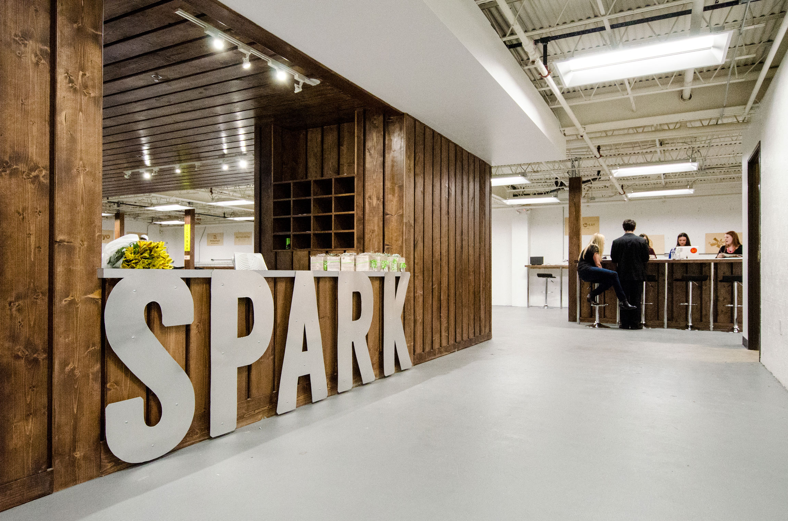
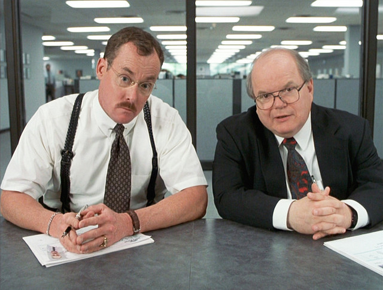
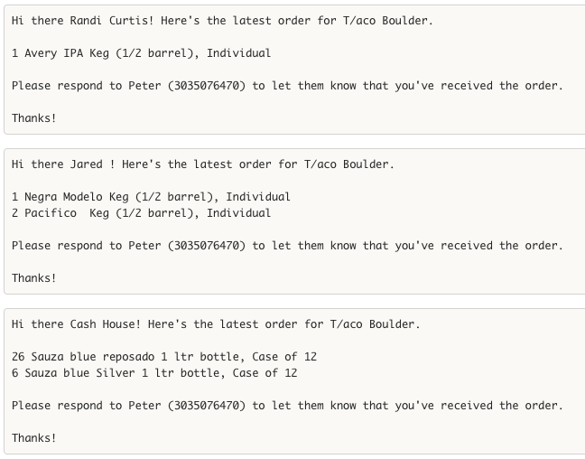
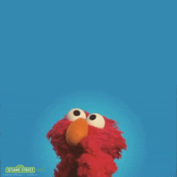

# Fireside chat with Ken Hoff

CU Boulder, CSCI 1000

2016-08-29

--------------------------------------------------------------------------------

# Hi there! I'm Ken.

I'm a web developer based out of Boulder.

More about me at [hoff.tech](https://hoff.tech/).

Show of hands - BS/BA/open option/other

--------------------------------------------------------------------------------

# How to be a web developer

-   Look stuff up on the internet
-   Make stuff
-   Repeat


--------------------------------------------------------------------------------

# Today, on Ken's fireside chat:


Obligatory Spark Classes pitch (sorry, gotta do it!)

What I used to do (CU, Microsoft)

What I'm doing now (consulting, Barfly)

Some freestyle web development (if ya wants)

--------------------------------------------------------------------------------

# Spark Classes



[Spark Boulder](http://sparkboulder.com/) is an entrepreneurial student co-working space on the Hill! It was founded a couple years back by my buddy [Fletcher](https://www.linkedin.com/in/fletchrichman).

I'm teaching **Front End Web Dev** and **Back End Web Dev** at Spark Boulder in the Fall!

Apply at <http://sparkboulder.com/sparkclasses/> or email my buddy **Danny Walsh** (<mailto:danny@sparkboulder.com>) - he runs all the operations stuff for Spark. Or, you can leave your name on the sheet up here and he'll get in touch with you.

## The deets

Classes start **October 3rd**

2x a week for 10 weeks

Evening classes - works with a full-time student schedule

Integrated project-based assignments

Taught by industry professionals

$999 per semester

## Front End Web Dev

Portfolio sites, sites for local businesses, and client-side web apps

HTML, CSS, JavaScript, and jQuery

Great for students who have never programmed before!

## Back End Web Dev

Create APIs, connect to databases, and handle authentication/payments

Node.js, Postgres, Modulus, plus some other libraries

Prereq: 6+ months of a _programming_ language (not markup), or you've completed CSCI 1300.

--------------------------------------------------------------------------------

# What I used to do

## Internships

USGS - detecting earthquakes with twitter - [usgs paper](https://pubs.er.usgs.gov/publication/70006356) - [xkcd comic](http://xkcd.com/723/)


lijit (now [sovrn](https://www.sovrn.com/)) - general development

[Rally Software](https://www.rallydev.com/) (now CA Technologies) - "intrapreneurial projects"

## CU Boulder

Graduated December 2013

Bachelor's of Science of Computer Science (HCC Track)

Senior Thesis: [Improving Educational Game Design Methods](https://github.com/kenhoff/thesis/blob/master/KenHoffThesis.pdf)

Favorite class? Startup Essentials for Software Engineering (CSCI 4830?)

_(might have been replaced by Entrepreneurial Capstone now)_

## Microsoft

Started working for Microsoft **July 2014** in Seattle, WA

I was a "Program Manager" - Microsoft's version of a "Product Manager" (different than a "[Project Manager](http://www.huffingtonpost.com/brian-de-haaff/the-product-manager-vs-pr_b_8040402.html)")



> Well-well look. I already told you: I deal with the god damn customers so the engineers don't have to. I have people skills; I am good at dealing with people. Can't you understand that? What the hell is wrong with you people?

Worked on **[Azure Active Directory](https://azure.microsoft.com/en-us/documentation/articles/active-directory-whatis/)** - on a tiny little feature called "Reporting"

Left **December 2015**, moved back to Boulder to work on consulting and side projects

Best part of Microsoft? The [hackathon](http://blogs.microsoft.com/jobs/story-library/oneweek-hackathon-shows-culture-shift-at-microsoft/) - 2 days of working on whatever we wanted to work on

--------------------------------------------------------------------------------

# What I'm doing now

## Consulting

Independent, freelance, contract, consulting, whatever you want to call it

I build web apps, frontends, APIs, and bots for people and companies.

More about me and my consulting work at [hoff.tech](https://hoff.tech/).

I work out of an office in Spark. Come say hi sometime!

## Barfly

I've got a side project that helps bars order liquor every week.

Bars have to order liquor in bulk from **distributors**. The problem is, each distributor carries different liquors, so bars have to put together 6-12 different distributor orders **every week**. On top of that, they have to order through **sales reps**, which usually only take text messages.

I built a web app to help with the process. Bar owners just see a list of all of their liquors, punch in what they need, and then we automatically send text messages to all of their sales reps.



I work with my buddy Peter, who runs [T/Aco](http://tacocolorado.com/) downtown on Walnut.

## Spark Classes

I'm teaching classes out of Spark, but you already heard about that!

One fun part is `@classbot`, a Slack bot that I built to replace my TA in the class!

To submit a web site that you built for an assignment, you first deploy your site to the internet, then send `@classbot` the URL to your site.

Then, `@classbot` goes to your site and _automatically_ grades it - you get a grade **instantly**, and you can submit assignments as many times as you want, whenever you want.

@classbot is [open source on GitHub](https://github.com/kenhoff/classbot).

--------------------------------------------------------------------------------

# I'm a web developer!

what does a web developer do?

Web developers is a pretty umbrella term, but I make **full-stack web apps**.

Examples of full-stack web apps are Facebook, Twitter, Instagram, almost everything consumer-facing at Google, etc

## Facebook for Dogs

For example, if you asked me to make **Facebook for Dogs**, that would be a full-stack web app.

You'd need to be able to go to <http://facebookfordogs.com/>, sign up (add some personal information), find and follow other Facebook for Dogs ™ users, see their posts, and create your own post. Maybe you'd like email notifications, or to be able to pay for a premium account.

Apps aren't cheap! To get an idea of how much it would take to build your app, check out [estimatemyapp.com](https://estimatemyapp.com/).

--------------------------------------------------------------------------------

# Web dev freestyling


--------------------------------------------------------------------------------

# You too can be a web developer!

Let's make a simple landing page for your portfolio.

_(you can also do this later, the slides will always be available at this URL)_

You will need a **text editor** (Not Microsoft Word or Pages - use Notepad on Windows, or TextEdit on the Mac)

I use [Atom](https://atom.io/)! It's pretty friggin cool.

First, bust open that text editor, and create a new file `index.html` (note the extension! no `.txt` or `.rtf` here), and save it.

Then, put the following contents into your `index.html` file and save it:

```html
<h1>Yournamehere's Portfolio Site</h1>
```

Then, find your `index.html`, and double-click it to open it in your browser!

(you can also do `ctrl-O` or `⌘-O` from your browser)

--------------------------------------------------------------------------------

# ｙｏｕ ａｒｅ ｎｏｗ ａ ｗｅｂ ｄｅｖｅｌｏｐｅｒ


--------------------------------------------------------------------------------

# MOAR WEB DEV

For the next part of your portfolio's landing page, you'll need your favorite image from [unsplash.com](https://unsplash.com/).

I like [mountains](https://unsplash.com/?photo=NDuPLKYRXQU)!

Download and save your file (upper right button) **in the same folder as your `index.html`**, and name it something like `mountains.jpeg`.

Replace the contents of your `index.html` file with the following:

```html
<html>
	<head>
		<link href="https://fonts.googleapis.com/css?family=Raleway:300,400,700" rel="stylesheet">
		<style>
			body {
				margin: 0;
				font-family: 'Raleway', sans-serif;
			}

			header {
				display: flex;
				justify-content: center;
				align-items: center;
				flex-direction: column;
				height: 100vh;
				background-image: url("mountains.jpeg");
				background-position: center;
				background-size: cover;
			}
		</style>
	</head>
	<body>
		<header>
			<h1>ken really loves mountains</h1>
			<p>
				Mathematical!
			</p>
		</header>
	</body>
</html>
```

--------------------------------------------------------------------------------

# EVEN MOAR WEB DEVS

break it down now

```html
<html>
	<head>
		<link href="https://fonts.googleapis.com/css?family=EB+Garamond|Montserrat:700|Raleway:300,400,700" rel="stylesheet">
		<link href="https://maxcdn.bootstrapcdn.com/font-awesome/4.6.3/css/font-awesome.min.css" rel="stylesheet" crossorigin="anonymous">
		<style>
			body {
				margin: 0;
				font-family: 'Raleway', sans-serif;
			}

			header {
				display: flex;
				justify-content: center;
				align-items: center;
				flex-direction: column;
				height: 100vh;
				background-image: linear-gradient(rgba(255, 255, 255, 0.5), rgba(255, 255, 255, 0.5)), url("mountains.jpeg");
				background-position: center;
				background-size: cover;
			}

			section {
				display: flex;
				flex-direction: row;
				flex-wrap: nowrap;
				align-items: center;
				justify-content: space-around;
				height: 100vh;
			}

			section> div {
				box-sizing: border-box;
				padding: 5em;
				max-width: 50%;
			}

			img {
				display: block;
				max-width: 100%;
				height: auto;
			}

			footer {
				height: 50px;
				display: flex;
				justify-content: space-around;
				align-items: center;
				flex-direction: row;
				flex-wrap: nowrap;
				font-family: 'EB Garamond', serif;
			}

			.logo {
				font-weight: bold;
				font-family: 'Montserrat', sans-serif;
				text-transform: uppercase;
			}
			a, a:active, a:visited, a:focus, a:hover {
				color: inherit;
				text-decoration: none;
			}
		</style>
	</head>

	<body>
		<header>
			<h1>ken really loves mountains</h1>
			<p>
				Mathematical!
			</p>
		</header>
		<main>
			<section>
				<div>
					
				</div>
				<div>
					<p>
						Ken is a cranky old townie who used to work for Microsoft.
					</p>
					<p>
						Ken codes poorly for a living to pay for pizza. He lives in Boulder with his cat and video games.
					</p>
					<p>
						Algebraic!
					</p>
				</div>
			</section>
		</main>
		<footer>
			<div>
				<i class="fa fa-code"></i> by <span class="logo"><a href="https://hoff.tech" target="_blank">Hofftech</a></span>
			</div>
			<div>Rhombus!</div>
		</footer>
	</body>
</html>
```

need some pretty simple hosting? check out [site44](http://www.site44.com/)

--------------------------------------------------------------------------------

# When you realize that web development is your life, forever:


--------------------------------------------------------------------------------

# What questions are there?



--------------------------------------------------------------------------------

# Obligatory Hofftech Pitch

Need a web app built, or know someone who does? Get in touch! <mailto:ken@hoff.tech>

--------------------------------------------------------------------------------

# How to be a web developer

-   Look stuff up on the internet
-   Make stuff
-   Repeat


--------------------------------------------------------------------------------

# Excelsior! 🚀

Hit me up about anything! If you have more questions about life after CU, web dev, interviewing, Microsoft, if you need me to look at your code, or even if you just want to get coffee. Totally down to help out students however I can.

## <mailto:ken@hoff.tech>

Thanks!
